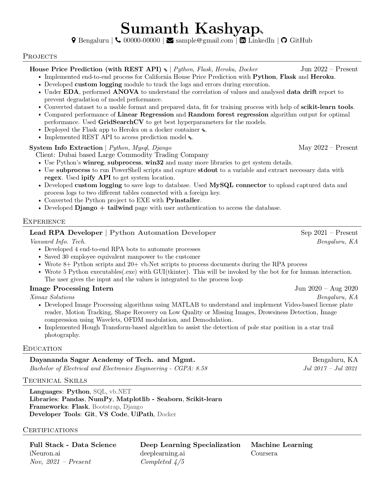

# Resume
Personal updated resume can be found in this repo.

# Projects in progress:
### - [**Mice Protein Expression**](https://github.com/bheemaguli/Mice-Protein-Expression)
<!-- ### - [**Image Captioning**](https://github.com/bheemaguli/Image-Captioning) -->

 

# Previous Projects:
 

<b>1. PO data extract and report generate with RPA</b>

 

*UiPath, Python, VB.Net, Regex*

*Nov 2021 - Jan 2022*

Aim: Extract product details from PO and update the database
Process:
* Download mail attachment with specific subject
* Generate Excel file with specific column format and sheets, generate folder and log to file with python
* Extract product data of table from PDFs (table configuration varies from customer to customer) and filter data with vb.net and regex in UiPath.
* Generate an Excel report with python using extraction data.
* Email the Report Excel after completion.

Outcome: Process 40k products a day with >90% efficiency and reduced 8 member equivalent manual labor cost.

 

<b>2. Commodity Upload Processing with RPA</b>

 

*Python, UiPath, VB.Net, Regex*

*Feb 2022 - Apr 2022*

Aim: Get input commodity curves, process file according to the database, upload to a website
Process:
* Prepare input file with vb.net in UiPath
* Ask the user whether the database needs to be updated with GUI made with Python and Tkinter.
* After database update, process input files with database data.
* Upload files to the website with UiPath.

Outcome: Reduced manpower wastage on repetitive manual tasks.

 

<b>3. <a href="https://github.com/bheemaguli/FlipkartReviewScrapper">Flipkart Review Scrapper</a></b>

 

*Python, Flask*

*Apr 2022 - May 2022*

Aim: Extract top Reviews from Flipkart with the given keyword
Process:
* Create flask landing page for search
* Get search query from the page
* Get web scrap of Flipkart with the given query
* Clear the resulting HTML with Beautiful Soup and get the required values
* Post the result on the page using flask

Outcome: Understand the working of chrome engine, flask, and HTML layout.

 

<b>4. <a href="https://docs.google.com/presentation/d/15Ds42YUpZaFY9qWuqYhXlFoyxCseWCql/edit?usp=sharing&ouid=107321296866101467124&rtpof=true&sd=true">Hybrid Speed Controller for BLDC Motor</a></b>

 

*Engineering Final Year Project*

*Mar 2021 - Aug 2021*

* After going through numerous research papers published in the past 8 years, it was found that there lacked a design that incorporates all the latest technology in a single controller unit. 
* Our team was successful in developing a design that incorporated Fuzzy-PI hybrid logic for velocity controller and FOC-SVPWM algorithm for current control. 
* The model was created, tweaked and optimized for optimal speed control of the BLDC motor in Simulink.

 

<b>5. <a href="https://docs.google.com/presentation/d/1ZSFhdfa_s99KiOhDXqg7qajt0Scr3VkG2Zj4fpJVma4/edit?usp=sharing">Conversion of ICE two-wheeler to an Electric Bike</a></b>

 

*Engineering Final Year Project*

*Dec 2019 - Feb 2020*

* To understand the underlying concepts of EVs, an ICE vehicle was electrified. 
* The vehicle was modified to use a 1KW BLDC motor and 10Ah Li-ion battery with appropriate modifications to the vehicle chassis. 
* The end product was able to deliver good performance with a range of 15 Kms and recorded a top speed of 62.8 kmph.

 

<b>6. Track sensing mini robot</b>

 

*Mini project for fun*

*Jan 2018 - Jan 2018*

Arduino is used to track and follows the path based on the feedback of the IR sensor. All programmed in Arduino C.

  

# Current
